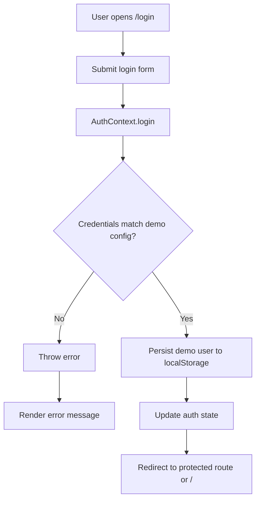
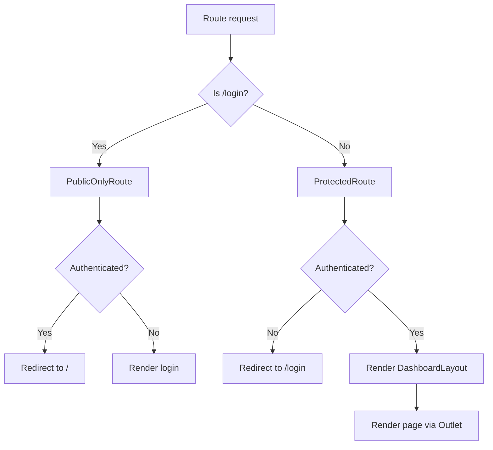

# Flows

## Overview

The most meaningful flows in the current repository are frontend navigation and local UI state flows. There are no real API request flows or database transaction flows present in code.

## Flow 1: demo login and protected access

### Confirmed entry point

- [src/pages/login/Login.tsx](/home/varner/aprendizagem/projetos/react-dash/src/pages/login/Login.tsx:1)

### Confirmed execution path

1. User opens `/login`.
2. Form state is initialized with demo credentials from [src/config/auth.ts](/home/varner/aprendizagem/projetos/react-dash/src/config/auth.ts:1).
3. On submit, `handleSubmit` calls `AuthContext.login`.
4. `AuthContext.login`:
   - normalizes email
   - waits 400 ms
   - compares email and password against demo config
5. On success:
   - writes `demoUser` to `localStorage`
   - updates React auth state
6. Login page redirects to:
   - `location.state.from.pathname` when available
   - otherwise `/`
7. Protected routes become accessible.

### Confirmed initialization behavior

- On provider initialization, `AuthContextProvider` attempts to hydrate the authenticated user from `localStorage` before route guards run.

### Validations

- Email is normalized with `trim().toLowerCase()`.
- Password is trimmed before comparison.

### Error handling

- Failed login throws an error with message `Use the demo account to access the dashboard.`
- Login page catches the error and renders the message.

### Persistence

- Browser `localStorage`, key: `react-dash.auth.user`

### External integration

- None

### Mermaid

### Files involved

- [src/pages/login/Login.tsx](/home/varner/aprendizagem/projetos/react-dash/src/pages/login/Login.tsx:1)
- [src/context/authContext.tsx](/home/varner/aprendizagem/projetos/react-dash/src/context/authContext.tsx:1)
- [src/config/auth.ts](/home/varner/aprendizagem/projetos/react-dash/src/config/auth.ts:1)
- [src/components/auth/ProtectedRoute.tsx](/home/varner/aprendizagem/projetos/react-dash/src/components/auth/ProtectedRoute.tsx:1)
- [src/components/auth/PublicOnlyRoute.tsx](/home/varner/aprendizagem/projetos/react-dash/src/components/auth/PublicOnlyRoute.tsx:1)

## Flow 2: route protection and shell rendering

### Confirmed entry point

- [src/App.tsx](/home/varner/aprendizagem/projetos/react-dash/src/App.tsx:1)

### Confirmed execution path

1. App mounts router.
2. `/login` is wrapped by `PublicOnlyRoute`.
3. Internal dashboard routes are wrapped by `ProtectedRoute`.
4. When authorized, `DashboardLayout` renders:
   - `Sidebar`
   - `Navbar`
   - `Outlet`
5. The selected page is rendered in the content area.
6. `Sidebar` can force light or dark mode and can call `logout`.
7. `Navbar` can toggle theme and call `logout`.

### Error handling

- No explicit route-level error boundaries exist.

### External integration

- None

### Mermaid

### Files involved

- [src/App.tsx](/home/varner/aprendizagem/projetos/react-dash/src/App.tsx:1)
- [src/components/auth/ProtectedRoute.tsx](/home/varner/aprendizagem/projetos/react-dash/src/components/auth/ProtectedRoute.tsx:1)
- [src/components/auth/PublicOnlyRoute.tsx](/home/varner/aprendizagem/projetos/react-dash/src/components/auth/PublicOnlyRoute.tsx:1)
- [src/components/layout/DashboardLayout.tsx](/home/varner/aprendizagem/projetos/react-dash/src/components/layout/DashboardLayout.tsx:1)

## Flow 3: users grid local delete behavior

### Confirmed entry point

- [src/components/datatable/Datatable.tsx](/home/varner/aprendizagem/projetos/react-dash/src/components/datatable/Datatable.tsx:1)

### Confirmed execution path

1. Component initializes local state with `userRows`.
2. `DataGrid` renders rows and columns.
3. Action column exposes:
   - a “View” link
   - a “Delete” action
4. Clicking Delete calls `handleDelete(id)`.
5. `handleDelete` filters the local `data` state.
6. Grid rerenders without the removed row.

### Validations

- No validation beyond row id existence in local array.

### Persistence

- None

### External integration

- None

### Error handling

- No explicit error handling.

### Files involved

- [src/components/datatable/Datatable.tsx](/home/varner/aprendizagem/projetos/react-dash/src/components/datatable/Datatable.tsx:1)
- [src/datatablesource.tsx](/home/varner/aprendizagem/projetos/react-dash/src/datatablesource.tsx:1)

## Flow 4: metadata-driven form rendering with image preview

### Confirmed entry point

- [src/pages/new/New.tsx](/home/varner/aprendizagem/projetos/react-dash/src/pages/new/New.tsx:1)

### Confirmed execution path

1. Route passes `inputs` and `title` from [src/App.tsx](/home/varner/aprendizagem/projetos/react-dash/src/App.tsx:1).
2. `New` stores selected file in local component state.
3. If a file is selected, preview uses `URL.createObjectURL(file)`.
4. If no file is selected, preview uses a fallback image URL.
5. Input fields are rendered by iterating over the provided metadata array.
6. Submit button is present, but there is no explicit React submit handler or persistence logic.
7. Because the form uses the browser default submit behavior, any resulting navigation/reload depends on the current browser environment and URL handling.

### Validation

- No runtime validation logic observed in source.

### Persistence

- None

### External integration

- None

### Files involved

- [src/pages/new/New.tsx](/home/varner/aprendizagem/projetos/react-dash/src/pages/new/New.tsx:1)
- [src/formSource.ts](/home/varner/aprendizagem/projetos/react-dash/src/formSource.ts:1)

## Flow 5: theme switching

### Confirmed entry points

- Sidebar Light button
- Sidebar Dark button
- Navbar toggle button

### Confirmed execution path

1. UI dispatches `LIGHT`, `DARK` or `TOGGLE`.
2. `darkModeReducer` returns new `darkMode` state.
3. `App` applies `app dark` or `app` root class.
4. CSS variables and themed selectors from [src/style/dark.scss](/home/varner/aprendizagem/projetos/react-dash/src/style/dark.scss:1) affect rendering.

### Files involved

- [src/components/sidebar/Sidebar.tsx](/home/varner/aprendizagem/projetos/react-dash/src/components/sidebar/Sidebar.tsx:1)
- [src/components/navbar/Navbar.tsx](/home/varner/aprendizagem/projetos/react-dash/src/components/navbar/Navbar.tsx:1)
- [src/context/darkModeContext.tsx](/home/varner/aprendizagem/projetos/react-dash/src/context/darkModeContext.tsx:1)
- [src/context/darkModeReducer.ts](/home/varner/aprendizagem/projetos/react-dash/src/context/darkModeReducer.ts:1)
- [src/style/dark.scss](/home/varner/aprendizagem/projetos/react-dash/src/style/dark.scss:1)
