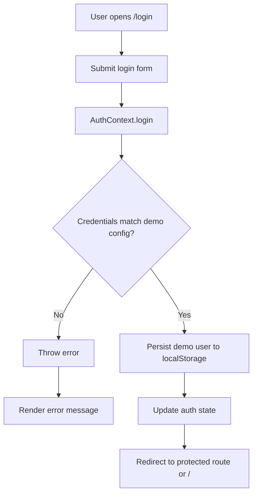
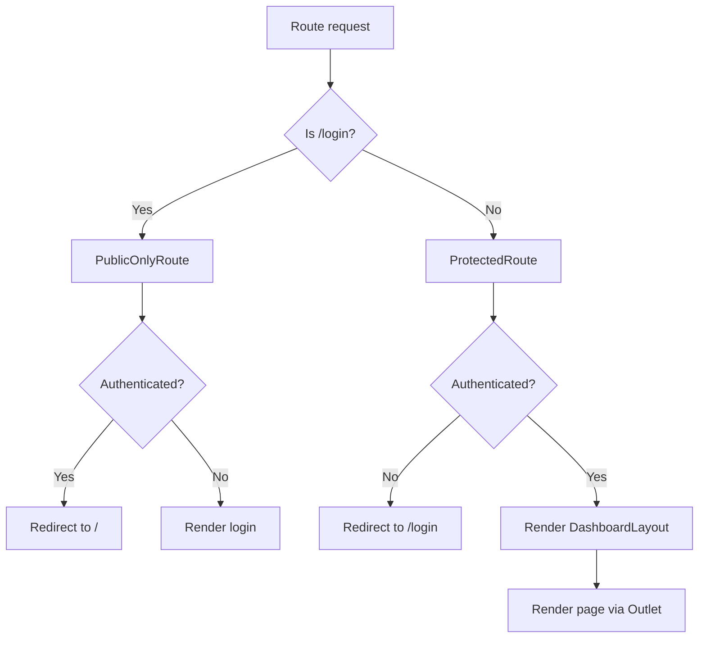
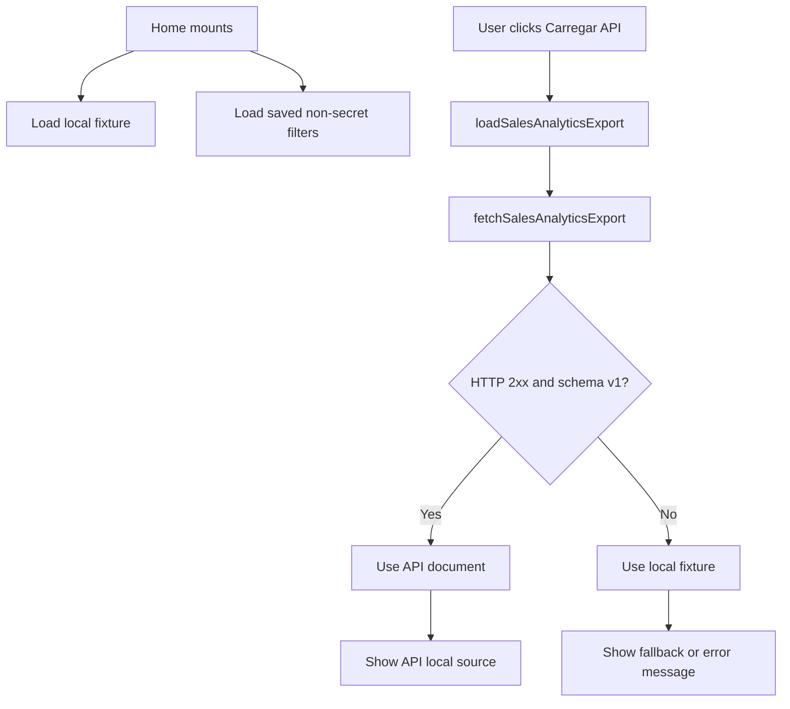

# Flows

## Overview

The most meaningful flows in the current repository are protected frontend
navigation, analytics fixture/API loading, browser-side exports and local UI
state. The app has no database transaction flow of its own, but it can call the
local `sales-event-project` analytics export API and falls back to the versioned
fixture when that API is unavailable.

## Flow 1: demo login and protected access

### Confirmed entry point

- [src/pages/login/Login.tsx](/home/varner/aprendizagem/projetos/react-dash/src/pages/login/Login.tsx:1)

### Confirmed execution path

1. User opens `/login`.
2. Form state is initialized with demo credentials from [src/config/auth.ts](/home/varner/aprendizagem/projetos/react-dash/src/config/auth.ts:1).
3. On submit, `handleSubmit` calls `AuthContext.login`.
4. `AuthContext.login`:
   - normalizes email
   - waits 400 ms
   - compares email and password against demo config
5. On success:
   - writes `demoUser` to `localStorage`
   - updates React auth state
6. Login page redirects to:
   - `location.state.from.pathname` when available
   - otherwise `/`
7. Protected routes become accessible.

### Confirmed initialization behavior

- On provider initialization, `AuthContextProvider` attempts to hydrate the authenticated user from `localStorage` before route guards run.

### Validations

- Email is normalized with `trim().toLowerCase()`.
- Password is trimmed before comparison.

### Error handling

- Failed login throws an error with message `Use the demo account to access the dashboard.`
- Login page catches the error and renders the message.

### Persistence

- Browser `localStorage`, key: `react-dash.auth.user`

### External integration

- None

### Mermaid


```mermaid
flowchart TD
  A[User opens /login] --> B[Submit login form]
  B --> C[AuthContext.login]
  C --> D{Credentials match demo config?}
  D -- No --> E[Throw error]
  E --> F[Render error message]
  D -- Yes --> G[Persist demo user to localStorage]
  G --> H[Update auth state]
  H --> I[Redirect to protected route or /]
```

### Files involved

- [src/pages/login/Login.tsx](/home/varner/aprendizagem/projetos/react-dash/src/pages/login/Login.tsx:1)
- [src/context/authContext.tsx](/home/varner/aprendizagem/projetos/react-dash/src/context/authContext.tsx:1)
- [src/config/auth.ts](/home/varner/aprendizagem/projetos/react-dash/src/config/auth.ts:1)
- [src/components/auth/ProtectedRoute.tsx](/home/varner/aprendizagem/projetos/react-dash/src/components/auth/ProtectedRoute.tsx:1)
- [src/components/auth/PublicOnlyRoute.tsx](/home/varner/aprendizagem/projetos/react-dash/src/components/auth/PublicOnlyRoute.tsx:1)

## Flow 2: route protection and shell rendering

### Confirmed entry point

- [src/App.tsx](/home/varner/aprendizagem/projetos/react-dash/src/App.tsx:1)
- [src/routes/AppRoutes.tsx](/home/varner/aprendizagem/projetos/react-dash/src/routes/AppRoutes.tsx:1)

### Confirmed execution path

1. App mounts router.
2. `/login` is wrapped by `PublicOnlyRoute`.
3. Internal dashboard routes are wrapped by `ProtectedRoute`.
4. When authorized, `DashboardLayout` renders:
   - `Sidebar`
   - `Navbar`
   - `Outlet`
5. The selected page is rendered in the content area.
6. `Sidebar` can force light or dark mode and can call `logout`.
7. `Navbar` can toggle theme and call `logout`.

### Error handling

- No explicit route-level error boundaries exist.

### External integration

- None

### Mermaid


```mermaid
flowchart TD
  A[Route request] --> B{Is /login?}
  B -- Yes --> C[PublicOnlyRoute]
  C --> D{Authenticated?}
  D -- Yes --> E[Redirect to /]
  D -- No --> F[Render login]
  B -- No --> G[ProtectedRoute]
  G --> H{Authenticated?}
  H -- No --> I[Redirect to /login]
  H -- Yes --> J[Render DashboardLayout]
  J --> K[Render page via Outlet]
```

### Files involved

- [src/App.tsx](/home/varner/aprendizagem/projetos/react-dash/src/App.tsx:1)
- [src/routes/AppRoutes.tsx](/home/varner/aprendizagem/projetos/react-dash/src/routes/AppRoutes.tsx:1)
- [src/components/auth/ProtectedRoute.tsx](/home/varner/aprendizagem/projetos/react-dash/src/components/auth/ProtectedRoute.tsx:1)
- [src/components/auth/PublicOnlyRoute.tsx](/home/varner/aprendizagem/projetos/react-dash/src/components/auth/PublicOnlyRoute.tsx:1)
- [src/components/layout/DashboardLayout.tsx](/home/varner/aprendizagem/projetos/react-dash/src/components/layout/DashboardLayout.tsx:1)

## Flow 3: analytics fixture/API loading and fallback

### Confirmed entry point

- [src/pages/home/Home.tsx](/home/varner/aprendizagem/projetos/react-dash/src/pages/home/Home.tsx:1)

### Confirmed execution path

1. `Home` initializes `document` with
   `localSalesAnalyticsFixture`.
2. `Home` loads persisted non-secret settings through
   [src/config/salesApi.ts](/home/varner/aprendizagem/projetos/react-dash/src/config/salesApi.ts:1):
   - `baseUrl`
   - `salesEventId`
   - `start`
   - `end`
   - `limit`
3. The API key field is kept only in component state.
4. When the user clicks `Carregar API`, `handleLoadApi` calls
   `loadSalesAnalyticsExport`.
5. `loadSalesAnalyticsExport` calls `fetchSalesAnalyticsExport`.
6. `fetchSalesAnalyticsExport`:
   - builds `GET /analytics/export?salesEventId=&start=&end=&limit=`
   - sends `Accept: application/json`
   - sends `X-API-Key` when the user provided one
   - rejects non-2xx responses with friendly status-specific messages
   - rejects payloads that do not use `schemaVersion:
     sales-analytics-export.v1`
7. On success:
   - `Home` replaces the current document with the API payload
   - source becomes `api`
   - the header shows API-local status text
8. On failure:
   - `loadSalesAnalyticsExport` returns the local fixture
   - source becomes `fixture`
   - `Home` renders the fallback/error message

### Persistence

- Browser `localStorage`, key: `react-dash.analytics.settings`
- Persisted values are non-secret filters only.
- API key values are not persisted.

### Error handling

- `400`: invalid analytics export filters
- `401`: missing API key
- `403`: role without permission for analytics export
- Network or unknown failures: generic API-load failure message
- Invalid schema: explicit `sales-analytics-export.v1` schema error

### External integration

- Optional local HTTP API:

```text
GET /analytics/export?salesEventId=&start=&end=&limit=
```

- Default frontend base URL: `/api`
- Vite proxy target: `http://localhost:8080`
- Expected backend project: `sales-event-project`

### Mermaid


```mermaid
flowchart TD
  A[Home mounts] --> B[Load local fixture]
  A --> C[Load saved non-secret filters]
  D[User clicks Carregar API] --> E[loadSalesAnalyticsExport]
  E --> F[fetchSalesAnalyticsExport]
  F --> G{HTTP 2xx and schema v1?}
  G -- Yes --> H[Use API document]
  H --> I[Show API local source]
  G -- No --> J[Use local fixture]
  J --> K[Show fallback or error message]
```

### Files involved

- [src/pages/home/Home.tsx](/home/varner/aprendizagem/projetos/react-dash/src/pages/home/Home.tsx:1)
- [src/analytics/api.ts](/home/varner/aprendizagem/projetos/react-dash/src/analytics/api.ts:1)
- [src/analytics/fixtures.ts](/home/varner/aprendizagem/projetos/react-dash/src/analytics/fixtures.ts:1)
- [src/config/salesApi.ts](/home/varner/aprendizagem/projetos/react-dash/src/config/salesApi.ts:1)
- [vite.config.js](/home/varner/aprendizagem/projetos/react-dash/vite.config.js:1)

## Flow 4: analytics transformation and rendering

### Confirmed entry point

- [src/pages/home/Home.tsx](/home/varner/aprendizagem/projetos/react-dash/src/pages/home/Home.tsx:1)

### Confirmed execution path

1. `Home` receives either the local fixture or API document.
2. Pure transformers in
   [src/analytics/transformers.ts](/home/varner/aprendizagem/projetos/react-dash/src/analytics/transformers.ts:1)
   derive:
   - KPI values
   - default `5m` time-series points
   - event table rows
   - event CSV rows
   - window CSV rows
   - funnel rows
   - survival summary rows
3. `Home` passes prepared data to page-level components:
   - `KpiGrid`
   - `AnalyticsCharts`
   - `InsightPanels`
   - `EventsTable`
   - `ExportPanel`
4. Empty or missing funnel/survival blocks render empty states rather than
   throwing.

### Error handling

- Empty analytics documents return zeros and empty arrays from transformers.
- Missing optional funnel/survival analyses render empty UI states.

### Files involved

- [src/analytics/transformers.ts](/home/varner/aprendizagem/projetos/react-dash/src/analytics/transformers.ts:1)
- [src/pages/home/components/KpiGrid.tsx](/home/varner/aprendizagem/projetos/react-dash/src/pages/home/components/KpiGrid.tsx:1)
- [src/pages/home/components/AnalyticsCharts.tsx](/home/varner/aprendizagem/projetos/react-dash/src/pages/home/components/AnalyticsCharts.tsx:1)
- [src/pages/home/components/InsightPanels.tsx](/home/varner/aprendizagem/projetos/react-dash/src/pages/home/components/InsightPanels.tsx:1)
- [src/pages/home/components/EventsTable.tsx](/home/varner/aprendizagem/projetos/react-dash/src/pages/home/components/EventsTable.tsx:1)

## Flow 5: browser-side analytics exports

### Confirmed entry point

- [src/pages/home/components/ExportPanel.tsx](/home/varner/aprendizagem/projetos/react-dash/src/pages/home/components/ExportPanel.tsx:1)

### Confirmed execution path

1. `ExportPanel` exposes actions for:
   - raw JSON
   - events CSV
   - windows CSV
   - events-by-window PNG
   - event-types PNG
2. JSON export serializes the active document.
3. CSV exports serialize rows prepared by analytics transformers.
4. PNG export finds the visible chart SVG, renders it to a canvas and downloads
   an image blob.
5. File names are built from the active document `generatedAt` date and a
   deterministic suffix.

### Error handling

- CSV/PNG actions are disabled when their corresponding dataset is empty.
- PNG export shows a user-facing message when the chart SVG, image loading or
  canvas blob generation fails.

### Files involved

- [src/pages/home/Home.tsx](/home/varner/aprendizagem/projetos/react-dash/src/pages/home/Home.tsx:1)
- [src/pages/home/components/ExportPanel.tsx](/home/varner/aprendizagem/projetos/react-dash/src/pages/home/components/ExportPanel.tsx:1)
- [src/analytics/exporters.ts](/home/varner/aprendizagem/projetos/react-dash/src/analytics/exporters.ts:1)

## Flow 6: users grid local delete behavior

### Confirmed entry point

- [src/components/datatable/Datatable.tsx](/home/varner/aprendizagem/projetos/react-dash/src/components/datatable/Datatable.tsx:1)

### Confirmed execution path

1. Component initializes local state with `userRows`.
2. `DataGrid` renders rows and columns.
3. Action column exposes:
   - a “View” link
   - a “Delete” action
4. Clicking Delete calls `handleDelete(id)`.
5. `handleDelete` filters the local `data` state.
6. Grid rerenders without the removed row.

### Validations

- No validation beyond row id existence in local array.

### Persistence

- None

### External integration

- None

### Error handling

- No explicit error handling.

### Files involved

- [src/components/datatable/Datatable.tsx](/home/varner/aprendizagem/projetos/react-dash/src/components/datatable/Datatable.tsx:1)
- [src/datatablesource.tsx](/home/varner/aprendizagem/projetos/react-dash/src/datatablesource.tsx:1)

## Flow 7: metadata-driven form rendering with image preview

### Confirmed entry point

- [src/pages/new/New.tsx](/home/varner/aprendizagem/projetos/react-dash/src/pages/new/New.tsx:1)

This is currently a legacy component and is not wired into the active
analytics route tree.

### Confirmed execution path

1. A caller passes `inputs` and `title` props.
2. `New` stores selected file in local component state.
3. If a file is selected, preview uses `URL.createObjectURL(file)`.
4. If no file is selected, preview uses a fallback image URL.
5. Input fields are rendered by iterating over the provided metadata array.
6. Submit button is present, but there is no explicit React submit handler or persistence logic.
7. Because the form uses the browser default submit behavior, any resulting navigation/reload depends on the current browser environment and URL handling.

### Validation

- No runtime validation logic observed in source.

### Persistence

- None

### External integration

- None

### Files involved

- [src/pages/new/New.tsx](/home/varner/aprendizagem/projetos/react-dash/src/pages/new/New.tsx:1)
- [src/formSource.ts](/home/varner/aprendizagem/projetos/react-dash/src/formSource.ts:1)

## Flow 8: theme switching

### Confirmed entry points

- Sidebar Light button
- Sidebar Dark button
- Navbar toggle button

### Confirmed execution path

1. UI dispatches `LIGHT`, `DARK` or `TOGGLE`.
2. `darkModeReducer` returns new `darkMode` state.
3. `App` applies `app dark` or `app` root class.
4. CSS variables and themed selectors from [src/style/dark.scss](/home/varner/aprendizagem/projetos/react-dash/src/style/dark.scss:1) affect rendering.

### Files involved

- [src/components/sidebar/Sidebar.tsx](/home/varner/aprendizagem/projetos/react-dash/src/components/sidebar/Sidebar.tsx:1)
- [src/components/navbar/Navbar.tsx](/home/varner/aprendizagem/projetos/react-dash/src/components/navbar/Navbar.tsx:1)
- [src/context/darkModeContext.tsx](/home/varner/aprendizagem/projetos/react-dash/src/context/darkModeContext.tsx:1)
- [src/context/darkModeReducer.ts](/home/varner/aprendizagem/projetos/react-dash/src/context/darkModeReducer.ts:1)
- [src/style/dark.scss](/home/varner/aprendizagem/projetos/react-dash/src/style/dark.scss:1)
